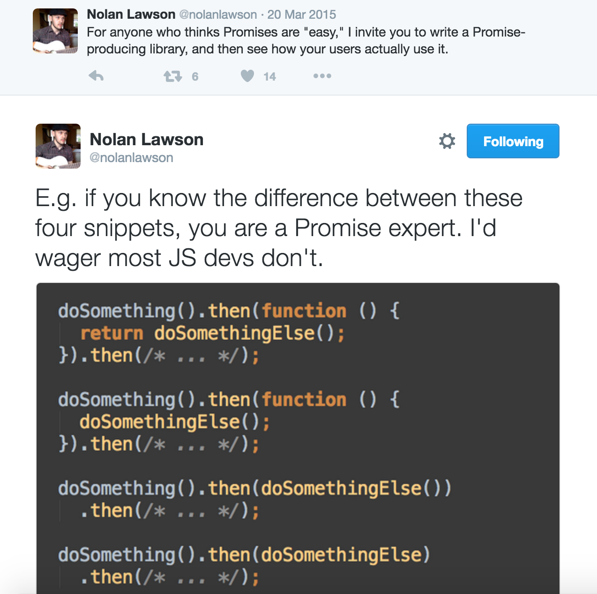

# Promise Test!

This repo contains a simple little quiz/test to challenge you're ability to work with [Promises](https://developer.mozilla.org/en-US/docs/Web/JavaScript/Reference/Global_Objects/Promise).

It was prompted by the [following tweet](https://twitter.com/nolanlawson/status/578948854411878400):

# Setup

1. `git clone https://github.com/staxmanade/javascript-promise-test.git`
2. `npm install`

# How to take the test.

1. Open the [test.js](test.js) file
2. Read the test code (all of it)
3. Fore each `expect(result).to.equal("???");` replace `"???"` with what you "think" the `result` will be.
4. Once you've filled in an answer for each of the tests/questions run `npm test` at the command prompt and see how you did.

## Good luck!

> P.S. I like to think I'm pretty good with promises, but I got question #3 wrong the first time I tried it :cry:.

